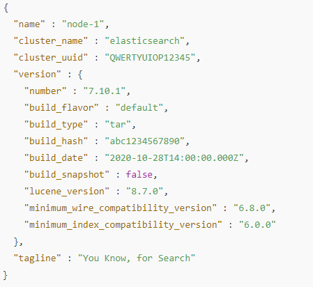

# Elastic-Search
Sample Project for Elastic Search Configuration

#  Download and Elastic Search Server UP

* Download Elasticsearch from the official site at [Elasticsearch](https://www.elastic.co/downloads/elasticsearch) 
* Extract the downloaded folder to your desired path.
    * Navigate to the extracted Elasticsearch folder, where you will find the `config` folder. Inside it, you will find the `elasticsearch.yml` file. 
    * To run Elasticsearch with security enabled, add the following configuration in `elasticsearch.yml`
      ```
      # Enable security features
        xpack.security.enabled: true
      ```
    * To run Elasticsearch with security disabled, add the following configuration in `elasticsearch.yml`
      ```
      # Enable security features
        xpack.security.enabled: false
      ```
    * Next, go to the `bin` folder of the downloaded Elasticsearch folder and run the command `elasticsearch.bat` in the command prompt
    * By default, Elasticsearch will have security enabled when it is first configured.
    * When security is enabled, you can check if Elasticsearch is running by accessing the URL `https://localhost:9200` over HTTPS.
    * When accessing the URL in a browser with security enabled, you will be prompted to enter a username and password.
    * The default password for the `elastic` user will be generated the first time you start Elasticsearch, as shown below:
        ```
       Password for the elastic user (reset with `bin/elasticsearch-reset-password -u elastic`):
       ###PASSWORD####
         ```
    * When security is disabled, Elasticsearch can be accessed without any username or password at `http://localhost:9200` using HTTP.
    * When the URL is accessed in the browser, you will be prompted with the following:
        
    * To add new User navigate to the bin folder and run the following command
      ```
       .\elasticsearch-users useradd new_username -p new_password  -r new_role
      ```

# Integrating Elasticsearch with Spring Boot

* To use Elasticsearch in a Spring Boot application, you can follow these steps. Spring Boot offers a powerful library called Spring Data Elasticsearch that simplifies integration with Elasticsearch.
Below are the steps to integrate Elasticsearch with Spring Boot.
  ## Step 1 : Add Dependency
     *   First, you'll need to add the appropriate dependencies in your pom.xml file
         ```
         <dependency>
		          <groupId>org.springframework.boot</groupId>
		          <artifactId>spring-boot-starter-data-elasticsearch</artifactId>
         </dependency>
         ```
    ## Step 2 : Create an Elasticsearch Model
  * Define an entity class (model) that will map to an Elasticsearch index. 
This is typically done with the `@Document` annotation  
    #### Example of an Elasticsearch Entity Class:
     ```
    import org.springframework.data.annotation.Id;
    import org.springframework.data.elasticsearch.annotations.Document;

    @Document(indexName = "users")  // The index name in Elasticsearch
    
    public class User {

    @Id
    private String id;

    private String firstName;
    private String lastName;
    private String email;

    // Getters and Setters
    public String getId() {
        return id;
    }

    public void setId(String id) {
        this.id = id;
    }

    public String getFirstName() {
        return firstName;
    }

    public void setFirstName(String firstName) {
        this.firstName = firstName;
    }

    public String getLastName() {
        return lastName;
    }

    public void setLastName(String lastName) {
        this.lastName = lastName;
    }

    public String getEmail() {
        return email;
    }

    public void setEmail(String email) {
        this.email = email;
    }
    
    }
    ```
    ## Step 3 : Create a Repository Interface
  *  Now, you’ll need to create a repository interface to interact with Elasticsearch.
Spring Data Elasticsearch provides a ElasticsearchRepository interface that you can extend.
  
    #### Example of the Repository Interface:
       ```
    import org.springframework.data.elasticsearch.repository.ElasticsearchRepository;
    import org.springframework.stereotype.Repository;

    @Repository
    public interface UserRepository extends ElasticsearchRepository<User, String> {
                // Custom query methods can be defined here, if needed
    }
    ```